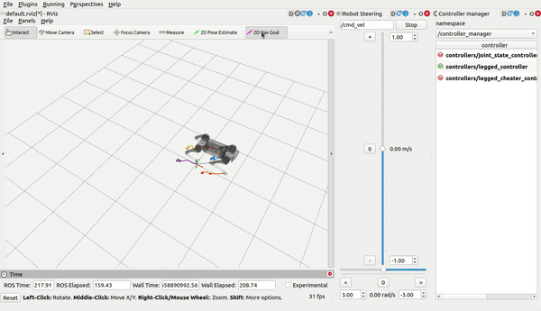
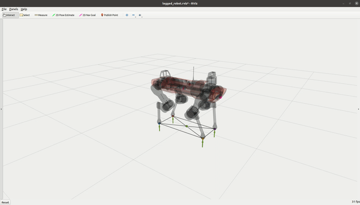
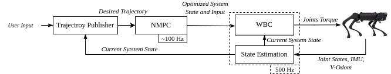
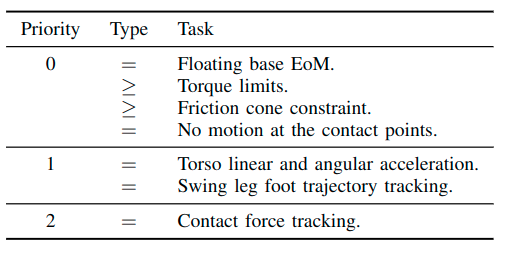

Imitation inspired deep reinforcement learning for monocular RGB embodied indoor navigation

 Yi Yan<sup>1</sup>, Yiheng Su<sup>1</sup>, Jiaqi Wang<sup>1</sup>, Limao Zhang<sup>1,*</sup>, Lijun Zhu<sup>2</sup>, Changyong Liu<sup>3</sup>, Jing Liu<sup>1</sup>, Zhuang Xia<sup>1</sup>, Mirosław J. Skibniewski<sup>4</sup>, Lieyun Ding<sup>1</sup>
1. National Center of Technology Innovation for Digital Construction, Huazhong University of Science and Technology; Wuhan, China.
2. School of Artificial Intelligence and Automation, Huazhong University of Science and Technology; Wuhan, China.
3. School of Civil Engineering, Harbin Institute of Technology; Harbin, China.
4. Department of Civil & Environment Engineering, University of Maryland; College Park, USA.


## 1. Installation

### 1.1 Create the environment and install Habitat-Sim

```bash
# clone our repo
git clone https://github.com/HUST-ZLMgroup/image_goal_nav
cd image_goal_nav

# create and activate the conda environment
conda create -n image_goal_nav python=3.8 -y
conda activate image_goal_nav

# install Habitat-Sim 0.2.2 with Bullet for a headless server or multi-GPU machine
conda install habitat-sim=0.2.2 withbullet headless -c conda-forge -c aihabitat

# on a workstation with a display, use this command instead:
# conda install habitat-sim=0.2.2 withbullet -c conda-forge -c aihabitat

# verify the Habitat-Sim installation
python -c "import habitat_sim; print('Habitat-Sim 0.2.2 is available')"
```

### 1.2 Install PyTorch and Habitat-Lab

Habitat-Lab 0.2.2 and Habitat-Baselines are included in this repository.

```bash
# install PyTorch 1.10 or later
pip install "torch>=1.10"

# install the bundled Habitat-Lab and Habitat-Baselines packages
cd habitat-lab
pip install -e habitat-lab
pip install -e habitat-baselines
cd ..
```

### 1.3 Install other requirements

```bash
pip install -r requirements.txt
```

## 2. Prepare dataset 
<!-- 
| ObjectNav   |   Gibson     | train    |  [objectnav_gibson_train](https://utexas.box.com/s/7qtqqkxa37l969qrkwdn0lkwitmyropp)    | `./data/datasets/zer/objectnav/gibson/v1/` |
| ObjectNav   |   Gibson     | val    |  [objectnav_gibson_val](https://utexas.box.com/s/wu28ms025o83ii4mwfljot1soj5dc7qo)    | `./data/datasets/zer/objectnav/gibson/v1/` | -->

### 2.1 Download Datasets 

For gibson dataset, we borrow the episodes generated from [`ZER`](https://github.com/ziadalh/zero_experience_required). We then follow the original [imagenav paper](https://arxiv.org/abs/2101.05181) to test . 

### 2.2 Download Scene Datasets 
Please read the [official guidance](https://github.com/facebookresearch/habitat-sim/blob/main/DATASETS.md#gibson-and-3dscenegraph-datasets) to download `Gibson`, `HM3D`, and `MP3D` scene datasets, and put them in the `data/scene_datasets` directory using lower-case naming. 

## 3.  Training 

### 3.1 Train the Image-Goal Navigation Agent
```bash
python -m torch.distributed.launch \
--nproc_per_node=4 --master_port=15344 --nnodes=1 \
--node_rank=0 --master_addr=127.0.0.1 \
main.py \
--exp-config exp_config/gibson_experiment.yaml,agent,task_objective,gibson_source,task_observations,context_prior \
--run-type train --model-dir results/train
```

## 4. Run Evaluation! 
### 4.1 Download the Trained Model to Reproduce the Results 

Download the trained checkpoint [model]( https://pan.baidu.com/s/1Hriw1U9iVpznKztb-qTnzg?pwd=1022 pwd: 1022), and move to $checkpoint_path.

Eval the model 

```bash
python -m torch.distributed.launch \
--nproc_per_node=1 --master_port=15244 --nnodes=1 \
--node_rank=0 --master_addr=127.0.0.1 \
main.py \
--exp-config exp_config/gibson_experiment.yaml,agent,task_objective,gibson_source,task_observations,context_prior,evaluation \
--run-type eval --model-dir results/eval_gibson \
habitat_baselines.eval_ckpt_path_dir $checkpoint_path
```
## 5. Unitree A1 Robot Platform

### 5.1 Unitree A1 Manuals

The following Unitree A1 documents are included in this repository for setup, operation, development, and mechanical integration.

| Document | Version / pages | Main content |
|---|---:|---|
| [A1 Software Manual (Chinese)](docs/unitree_a1/manuals/a1_software_manual_zh.pdf) | V1.0 / 16 pages | Network setup, coordinate systems, kinematics, dynamics, SDK APIs, motor control, ROS, RViz, and Gazebo |
| [A1 Mechanical Interface Drawing](docs/unitree_a1/manuals/a1_mechanical_interface_drawing.pdf) | 1 page | Top mounting-hole positions and mechanical dimensions |
| [A1 Quick Start Guide (Chinese)](docs/unitree_a1/manuals/a1_quick_start_guide_zh.pdf) | V1.0 / 21 pages | Safety notices, unpacking, startup, remote control, charging, and basic operation |
| [A1 User Manual (Chinese)](docs/unitree_a1/manuals/a1_user_manual_v1.2_zh.pdf) | V1.2 / 44 pages | Product overview, operating modes, maintenance, troubleshooting, and safety procedures |

Read the Quick Start Guide and User Manual before powering or commanding the physical robot. Keep the robot clear of people and obstacles, use a support frame or safety tether during early tests, and validate every controller in simulation first.

### 5.2 A1 Control Module

This control workflow is adapted from [qiayuanl/legged_control](https://github.com/qiayuanl/legged_control), an NMPC-WBC, state-estimation, and sim-to-real framework built on [OCS2](https://github.com/leggedrobotics/ocs2) and [ros-control](http://wiki.ros.org/ros_control). The upstream project is no longer actively supported, so pin and test all dependencies before deployment.

#### Bundled source code

The complete upstream source snapshot at commit [`a7f381c`](https://github.com/qiayuanl/legged_control/commit/a7f381c0367e98e31c01336e678eef47e304d40d) is included in [`control/legged_control`](control/legged_control). It contains the common utilities, NMPC formulation, ROS controllers, state estimation, Unitree A1/Aliengo/Go1 examples, Gazebo integration, hardware interfaces, WBC, and qpOASES catkin package. The source retains its original [BSD-3-Clause license](control/legged_control/LICENSE) and copyright notice; snapshot provenance is recorded in [`control/README.md`](control/README.md).

#### Demonstration video

The original NMPC-WBC demonstration is shown directly below. A repository copy is also available at [docs/legged_control/media/nmpc_wbc_demo.mp4](docs/legged_control/media/nmpc_wbc_demo.mp4).

https://user-images.githubusercontent.com/21256355/192135828-8fa7d9bb-9b4d-41f9-907a-68d34e6809d8.mp4

#### Control example



#### Dependencies and build

Place the bundled control stack and its dependencies in the <code>src</code> directory of a ROS catkin workspace. OCS2 is a large monorepo; only build <code>ocs2_legged_robot_ros</code>, <code>ocs2_self_collision_visualization</code>, and their dependencies. Run the first three commands below from the root of this repository.

~~~bash
# Copy the control source bundled with this repository
mkdir -p ~/catkin_ws/src
cp -a control/legged_control ~/catkin_ws/src/
cd ~/catkin_ws/src

# OCS2 and required geometry/dynamics libraries
git clone https://github.com/leggedrobotics/ocs2.git
git clone --recurse-submodules https://github.com/leggedrobotics/pinocchio.git
git clone --recurse-submodules https://github.com/leggedrobotics/hpp-fcl.git
git clone https://github.com/leggedrobotics/ocs2_robotic_assets.git

sudo apt update
sudo apt install liburdfdom-dev liboctomap-dev libassimp-dev

cd ~/catkin_ws
catkin config -DCMAKE_BUILD_TYPE=RelWithDebInfo
catkin build ocs2_legged_robot_ros ocs2_self_collision_visualization

# Main controller and A1 description
catkin build legged_controllers legged_unitree_description

# Simulation only; do not run Gazebo on the onboard computer
catkin build legged_gazebo

# Physical A1 hardware interface; not required for simulation-only use
catkin build legged_unitree_hw
source devel/setup.bash
~~~

The expected OCS2 legged-robot behavior is illustrated below.



#### Quick start

Set the robot type before starting either simulation or hardware:

~~~bash
export ROBOT_TYPE=a1
~~~

Start one of the following launch files:

~~~bash
# Gazebo simulation
roslaunch legged_unitree_description empty_world.launch

# Physical A1 hardware
roslaunch legged_unitree_hw legged_unitree_hw.launch
~~~

Load the controller:

~~~bash
roslaunch legged_controllers load_controller.launch cheater:=false
~~~

Start the real-state controller through <code>controller_manager</code>:

~~~bash
rosservice call /controller_manager/switch_controller "start_controllers: ['controllers/legged_controller']
stop_controllers: ['']
strictness: 0
start_asap: false
timeout: 0.0"
~~~

The controller can alternatively be managed through the ROS GUI:

~~~bash
sudo apt install ros-noetic-rqt-controller-manager
rosrun rqt_controller_manager rqt_controller_manager
~~~

Select the gait in the terminal running <code>load_controller.launch</code>. Command robot motion with <code>cmd_vel</code> or <code>move_base_simple/goal</code> and inspect state, trajectories, contacts, and forces in RViz.

> **Hardware safety:** never start <code>legged_cheater_controller</code> on the physical robot. It depends on simulator ground-truth state. Gait selection and motion goals are separate commands; do not command a stance transition merely because all four feet already contact the ground.

#### Control architecture



The control path is:

1. A desired torso velocity or position goal is converted into a target state trajectory.
2. NMPC optimizes the predicted robot state and control input over a finite horizon.
3. WBC converts the optimized state and contact-force references into joint torques.
4. Feed-forward torque and low-gain joint position/velocity PD commands are sent to the motor controllers to reduce impact and improve tracking.
5. IMU and joint measurements provide the current orientation and joint state. A linear Kalman filter estimates base position and velocity from orientation, acceleration, and foot-position measurements.

#### Nonlinear model predictive control

At each control cycle, NMPC solves a constrained optimal-control problem:

```math
\left\{
\begin{aligned}
\min_{u(\cdot)}\quad
& \phi\bigl(x(t_I)\bigr)
+ \int_{t_0}^{t_I} l\bigl(x(t),u(t),t\bigr)\,dt \\
\mathrm{s.t.}\quad
& x(t_0)=x_0,
&& \text{initial state} \\
& \dot{x}(t)=f\bigl(x(t),u(t),t\bigr),
&& \text{system flow map} \\
& g_1\bigl(x(t),u(t),t\bigr)=0,
&& \text{state-input equality constraints} \\
& g_2\bigl(x(t),t\bigr)=0,
&& \text{state-only equality constraints} \\
& h\bigl(x(t),u(t),t\bigr)\geq 0,
&& \text{inequality constraints}
\end{aligned}
\right.
```

The state and input vectors are defined as

```math
\mathbf{x}
=
\begin{bmatrix}
\mathbf{h}_{com}^{T} & \mathbf{q}_{b}^{T} & \mathbf{q}_{j}^{T}
\end{bmatrix}^{T},
\qquad
\mathbf{u}
=
\begin{bmatrix}
\mathbf{f}_{c}^{T} & \mathbf{v}_{j}^{T}
\end{bmatrix}^{T}.
```

Here, $\mathbf{h}_{com}\in\mathbb{R}^{6}$ is the normalized centroidal momentum; $\mathbf{q}_{b}$ and $\mathbf{q}_{j}$ are the floating-base and joint coordinates; $\mathbf{f}_{c}\in\mathbb{R}^{12}$ contains the four three-dimensional ground-reaction forces; and $\mathbf{v}_{j}$ contains joint velocities. The model includes friction-cone constraints, zero motion at stance feet, and a gait-dependent vertical trajectory for each swing foot. Multiple shooting converts the problem into a nonlinear program, Sequential Quadratic Programming solves the NLP, and HPIPM solves the resulting QP subproblems.

#### Whole-body control



WBC solves an instantaneous hierarchical QP with decision vector

```math
\mathbf{x}_{wbc}
=
\begin{bmatrix}
\ddot{\mathbf{q}}^{T} & \mathbf{f}_{c}^{T} & \boldsymbol{\tau}^{T}
\end{bmatrix}^{T},
```

where $\ddot{\mathbf{q}}$ is generalized acceleration, $\mathbf{f}_{c}$ is the contact-force vector, and $\boldsymbol{\tau}$ is the joint-torque vector. Higher-priority equality constraints define a null space for lower-priority tasks, while inequality slack variables are minimized. This preserves the task hierarchy while accounting for full nonlinear rigid-body dynamics.

#### Physical A1 integration

For a physical A1, use an external computer such as an Intel NUC for NMPC/WBC computation. The hardware adapter should inherit <code>LeggedHW</code> and implement the <code>read()</code> and <code>write()</code> interfaces following the upstream <code>UnitreeHW</code> implementation. Robot URDF joint and link names must match the names expected by <code>legged_unitree_description</code>.

Before enabling motor output:

1. Verify the URDF, joint directions, limits, and zero positions against the manuals in Section 5.1.
2. Confirm IMU orientation, joint-state order, foot-contact signals, and network interfaces.
3. Validate standing, gait switching, velocity commands, emergency stop, and communication-loss handling in simulation.
4. Use a safety frame or tether for the first hardware tests and keep an operator ready to stop the robot.

## Cite This Paper! 
